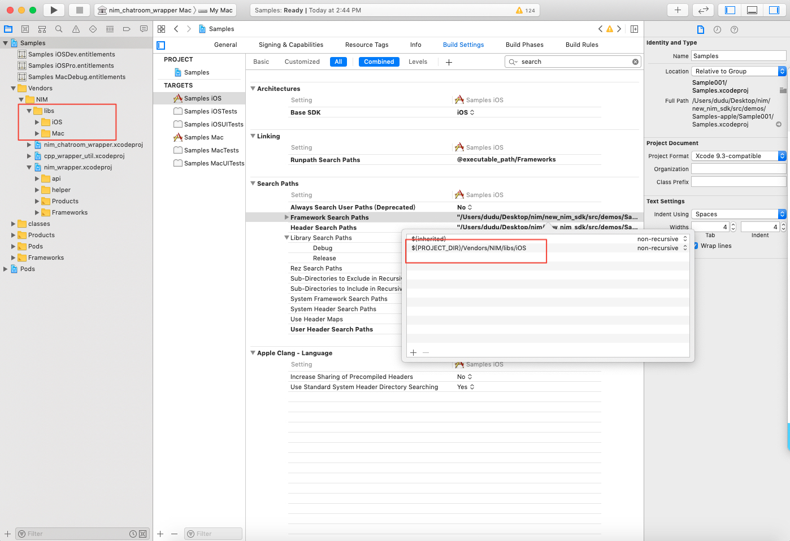
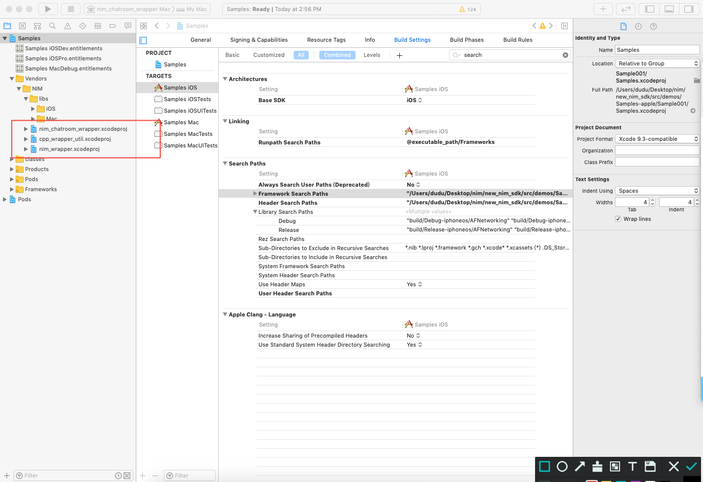

# iOS/Mac c++封装层接入指南

## 快速接入

参考[官方文档](http://dev.netease.im/docs/product/通用/新手接入/即时通讯/WindowsGettingStarted "target=_blank")

## 文件包含目录

引入iOS SDK 开发库,以Samples-app 的工程为例

## framework库引入

将nim_sdk/libs/iOS目录直接拖进项目中去,设置Framework Search Paths(正常情况下，将目录拖进项目后会自动添加，不需要再手动设置)
<div align="center"></div>

##  c++封装层引入解决方案

C++封装层的工程文件在nim_sdk/src/nim/、nim_sdk/src/nim_chatroom/、nim_sdk/src/depend_lib/src/cpp_wrapper_util/目录下，可以直接添加到解决方案中,如下图
<div align="center"></div>


设置Header Search Paths,设置recursive模式，如图所示


<div aglin="center" > <image src="./images/eb41a48fe8b240609512a5fc43bafc9a_38eb81a610cac2d9d4f1c10d2e60c7b2.jpg" /> </div>
link相关项目依赖的.a/.framework库文件

<div> <image src="./images/a9469e7a1d27437e9cfbee909ca3b28d_81e71fafee0e6fb091781fe4a5effeed.jpg"/> </div>
在iOS SDK的包含了i386/x86_64 archs,在最终打包发布会导致失败，可以手动通过命令移除。

```bash
lipo -remove i386 xxx -output xxx
lipo -remove x86_64 xxx -output xxx
```

或者在项目中添加脚本，Build Phases->New Run Script Phase,然后将如下代码写入该新建的item中,勾选Run script only when insatalling,可参考sample设置

```bash
#!/bin/sh

# Strip invalid architectures

strip_invalid_archs() {
binary="$1"
echo "current binary ${binary}"
# Get architectures for current file
archs="$(lipo -info "$binary" | rev | cut -d ':' -f1 | rev)"
stripped=""
for arch in $archs; do
if ! [[ "${ARCHS}" == *"$arch"* ]]; then
if [ -f "$binary" ]; then
# Strip non-valid architectures in-place
lipo -remove "$arch" -output "$binary" "$binary" || exit 1
stripped="$stripped $arch"
fi
fi
done
if [[ "$stripped" ]]; then
echo "Stripped $binary of architectures:$stripped"
fi
}

APP_PATH="${TARGET_BUILD_DIR}/${WRAPPER_NAME}"

# This script loops through the frameworks embedded in the application and
# removes unused architectures.
find "$APP_PATH" -name '*.framework' -type d | while read -r FRAMEWORK
do
FRAMEWORK_EXECUTABLE_NAME=$(defaults read "$FRAMEWORK/Info.plist" CFBundleExecutable)
FRAMEWORK_EXECUTABLE_PATH="$FRAMEWORK/$FRAMEWORK_EXECUTABLE_NAME"
echo "Executable is $FRAMEWORK_EXECUTABLE_PATH"

strip_invalid_archs "$FRAMEWORK_EXECUTABLE_PATH"
done


```


至此，库引入已完成。


## samples项目结构介绍

该samples项目主要是为了提供示例代码而存在。该samples项目并非是完整的覆盖所有接口的，用户仅用于集成参考.

代码结构如图：
<div> <image src="./images/7fc22138a2c44e8caa853fd359d25adc_51ea923d3b857fe84e11a2cb3fde279b.jpg" /></div>


通过NIMSDK来暴露接口

```objective-c
//
//  NIMSDK.h
//  Samples iOS
//
//  Created by dudu on 2019/11/20.
//

#import <Foundation/Foundation.h>

#import "NIMSDKDelegateType.h"
#import "NIMSDKLoginServiceProtocol.h"
#import "NIMSDKSessionServiceProtocol.h"
#import "NIMSDKChatroomServiceProtocol.h"


@interface NIMSDK : NSObject

+(instancetype)shared;


-(void)setup;
-(void)cleanup;

-(void)addDelegate:(id)delegate forType:(NIMSDKDelegateType)type;
-(void)removeDelegate:(id)delegate forType:(NIMSDKDelegateType)type;

-(id<NIMSDKLoginServiceProtocol>)loginService;

-(id<NIMSDKSessionServiceProtocol>)sessionService;

-(id<NIMSDKChatroomServiceProtocol>)chatroomService;

@property (nonatomic,strong)NSString* appKey;
@property (nonatomic,strong)NSString* apnsCername;

@property (nonatomic,strong)NSString* deviceToken;
@end


```

具体使用请参看samples-apple相关的代码实现。 

## SDK回调应用层的异步实现

SDK在回调应用层时，如果应用层没有进行异步处理，可能会阻塞SDK内部线程，发生SDK没有响应、断线等问题，为了避免这种情况的发生，应用层在接收到SDK的回调时最好转为异步。SDK实现了指定异步回调的接口

	/** @fn void SetCallbackFunction(const ChatRoom::SDKClosure& callback)
  	* 当以动态库使用SDK时 设置SDK回调方法，为了不阻塞SDK线程，在回调中应该把任务抛到应用层的线程中
  	* @param[in] callback	  回调方法
  	* @return void 无返回值

    	*/
    static void SetCallbackFunction(const SDKClosure& callback);
